Your campus breakout begins here.

# Team Members
- [Varun Nayak](https://www.github.com/Vrun1506)
- [Louis Burdon](https://github.com/impossible909)
- [George Overton](https://github.com/g-overtn)
- [Sam Russell](https://github.com/Sublime-Apple-Pie)
- [Vivaan Kampani](https://github.com/vivkampo)
- [Alex Nevard](https://github.com/AX-15)
- [Teva Geffen](https://github.com/TevaGeffen)
- [Gaoman Zhu](https://github.com/lztyblog)

## Downloads

- **Game JAR:** [Download the game](Website/docs/JAR-file/Escape_From_Uni.jar)

> Tip: On some systems you may need to allow running unsigned apps. Run with: `java -jar Escape_From_Uni.jar`

Alternatively, you can download the game from our official GitHub release: [Our official GitHub release](https://github.com/Vrun1506/team10project-continuance/releases/tag/1.0.0)

## GitHub repositories 

**Old Team 10 GitHub Repository due in November 2025**
[Old Team Repo for Nov submission prior to our takeover:](https://github.com/alistudentgit/team10project)

**New Team 7 GitHub Repository due in January 2026**
[Team Repo for Jan submission](https://github.com/Vrun1506/team10project-continuance)

## Old Team 7 Documentation for the November submission window (PDF)

- [Requirements (Req1.pdf)](Website/docs/Req1.pdf)
- [Planning (Plan1.pdf)](Website/docs/Plan1.pdf)
- [Architecture (Arch1.pdf)](Website/docs/Arch1.pdf)
- [Risk Management (Risk1.pdf)](Website/docs/Risk1.pdf)

## New Documentation (PDF) for Submission 2 which is due in January from Team 7

- [ChangeReport (Change2.pdf)]()
- [Implementation (Impl2.pdf)]()
- [Testing (Test2.pdf)]()
- [Evaluation (Eval2.pdf)]()
- [Continuous Integration(CI) (CI2.pdf)]()

## New Documentation (Google Drive) for Submission 2 due in January from Team 7 (WITH FULL EDITOR PERMISSIONS)

- <a href="https://docs.google.com/document/d/1vClVzyRyB1Jl8XOTSKQOmo-ncYLR12J5jfrWSiqIPK4/edit?usp=sharing">Change Report</a>
- <a href="https://docs.google.com/document/d/1lBK4A56g47P9UbvHHruwrrzSc-XqoZqnNrQV8FCQE5I/edit?usp=sharing">Implementation</a>
- <a href="https://docs.google.com/document/d/14iI3FgdnEt2vqVst6WNV1Zwqqa02Si_jDdksdJCayFU/edit?usp=sharing">Testing</a>
- <a href="https://docs.google.com/document/d/1hODIOdoXncceYOCO8xjJm8qRctQoHV9sn9L-3KAYyP8/edit?usp=sharing">User Evaluation</a>
- <a href="https://docs.google.com/document/d/1RcTtQWnfwZG9uEBkW1WW5IOyxctZFoSl/edit?usp=sharing">Continuous Integration (CI)</a>

## Documents that were updated in the Change Report

## Testing reports

### JUnit in headless mode testing report

**Test Report:**

<iframe src="Website/docs/reports/tests/index.html" width="100%" height="600" style="border: 1px solid #000;"></iframe>
 
 

### Checkstyle Code Reports

**Game Code Consistency Report:**

<iframe src="Website/docs/reports/checkstyle/core/main.html" width="100%" height="600" style="border: 1px solid #000;"></iframe>

 

**Test Code Consistency Report:**

<iframe src="Website/docs/reports/checkstyle/core/test.html" width="100%" height="600" style="border: 1px solid #000;"></iframe>

 
 

### JaCoCo Test Coverage report

**Test Coverage Report:**

<iframe src="Website/docs/reports/jacoco/index.html" width="100%" height="600" style="border: 1px solid #000;"></iframe>

### Architecture
These are the key diagrams in our project which have been adapted to the new implementation.

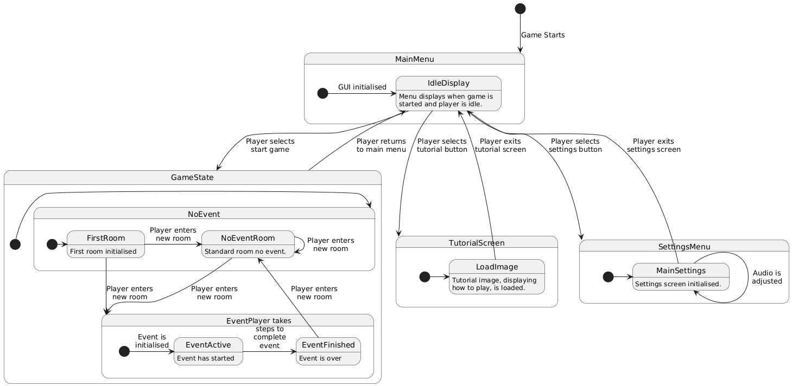

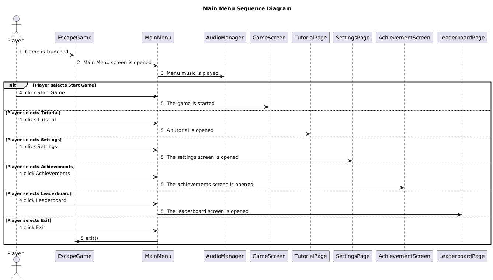

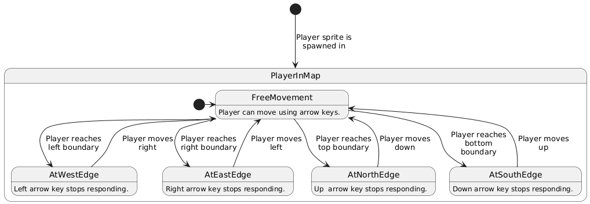

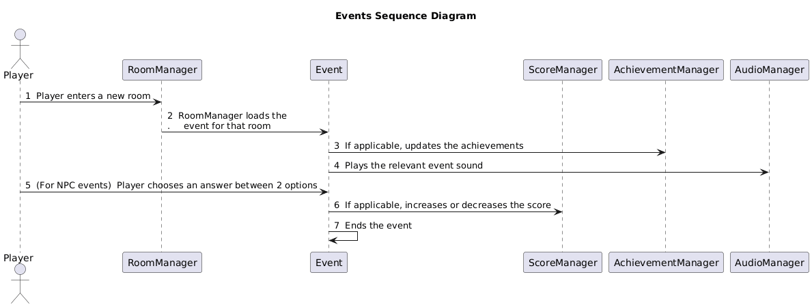

### User Evaluation Charts

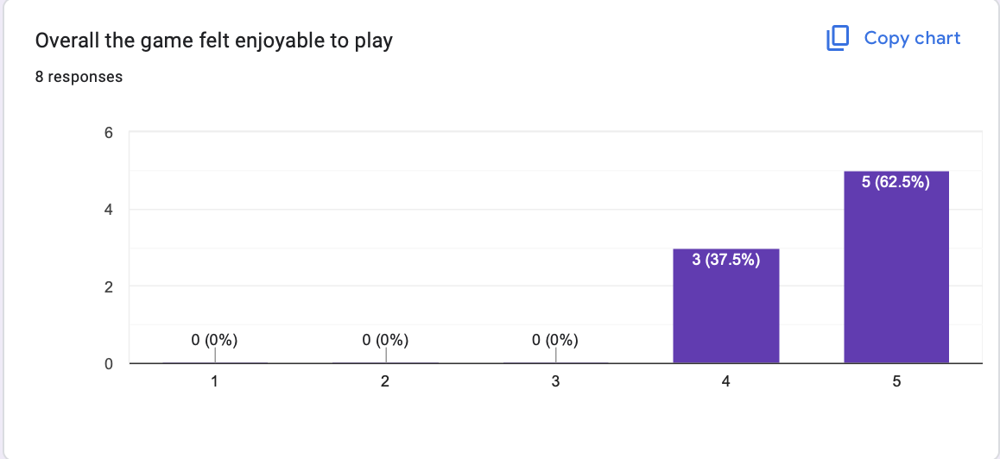

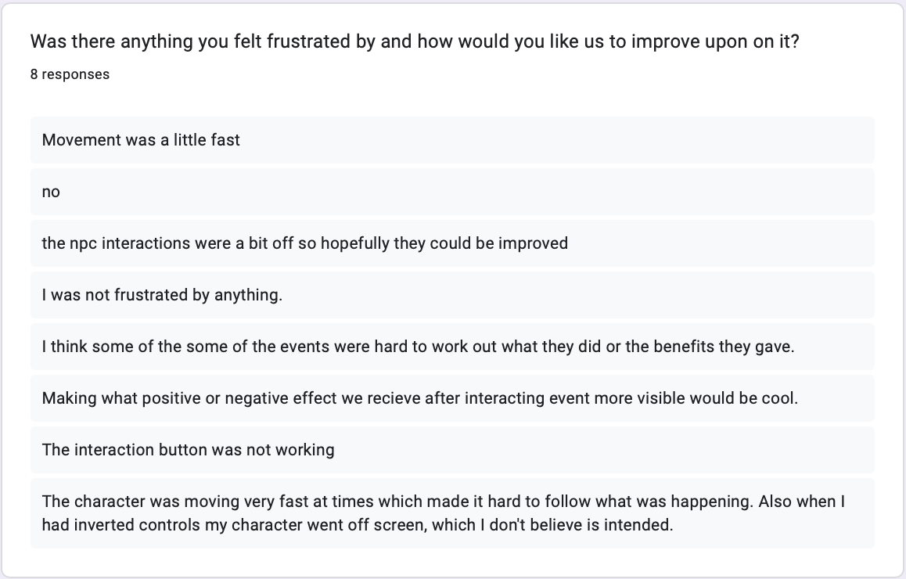

We conducted our user evaluation on the version of our code which had implemented the Achievements and Leaderboard functionalities.
We felt that this was the perfect time to do it as we could figure out any additional features that needed adding. 
We had a few ideas ourselves like the NPC interaction and maybe adding some hints, which is why we continued implementing the features we had in mind, and the user evaluation also pointed to the same ideas, which we implemented. 
Following our user evaluation, we fixed and implemented the following features:

1) Fixed swapped controls bug - When the arrow keys swapped over, there was a bug that allowed you to leave the map on every screen.

2) Decreased player speed - a lot of people mentioned the player going too fast after picking up powerups. 

3) Hints - Following the implementation from the other team, we added several new rooms and events, and the map became very complicated. Some of the responses told us to add some hints to the game to make it slightly easier. 

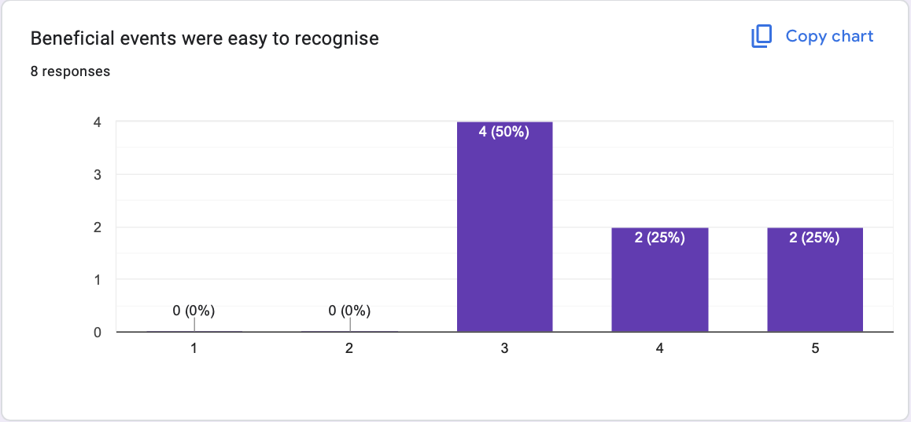

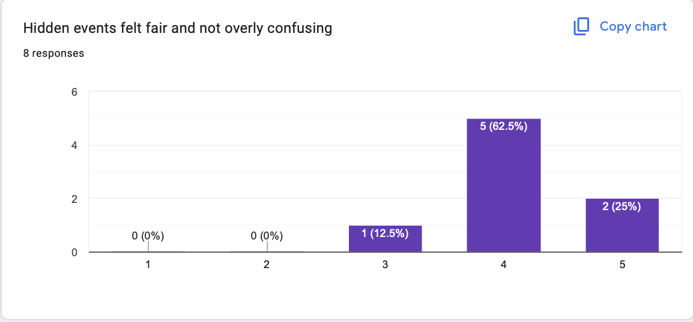

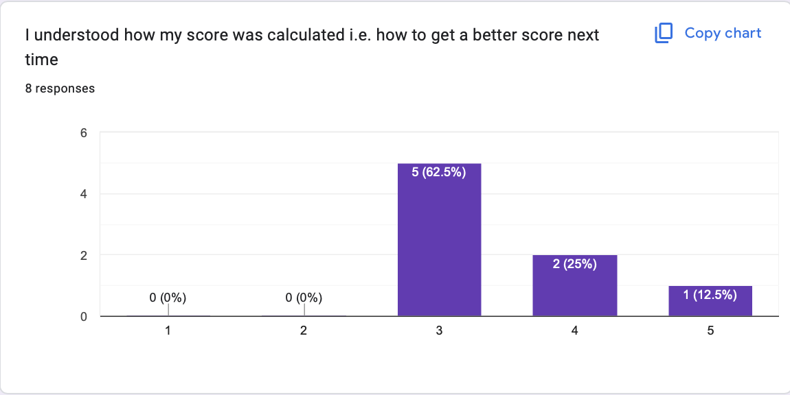

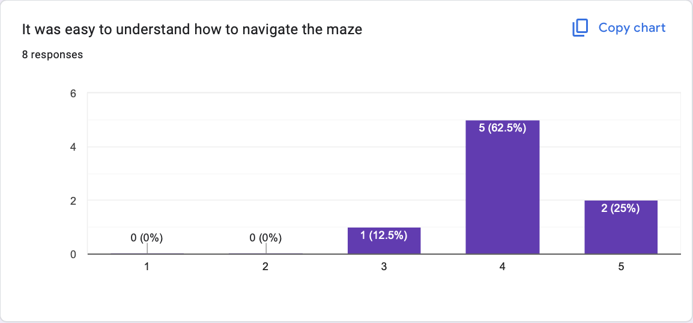

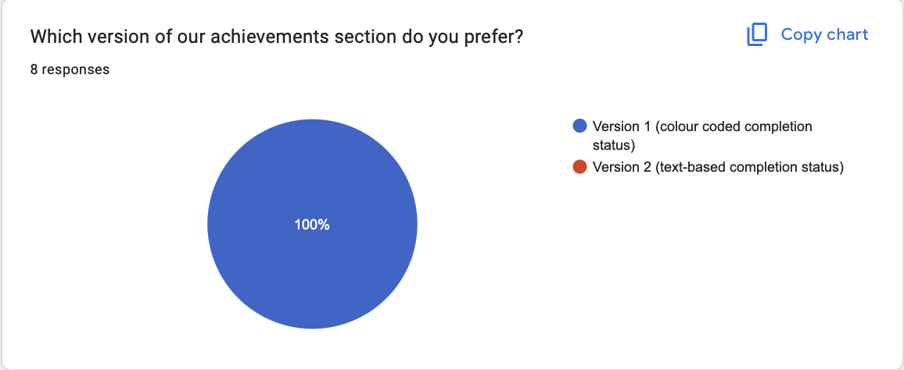

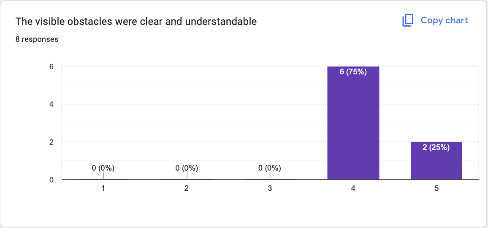

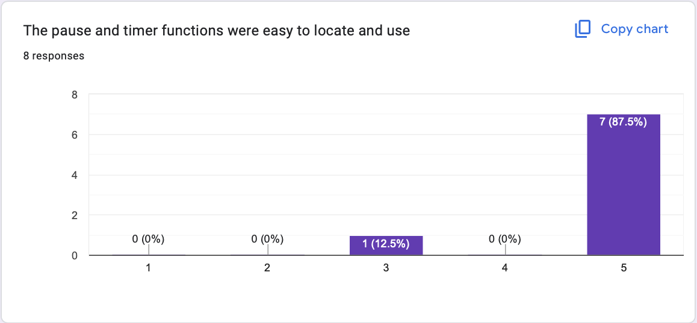

